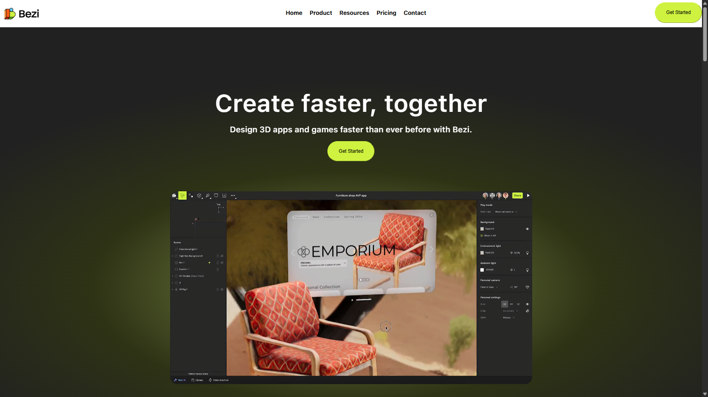
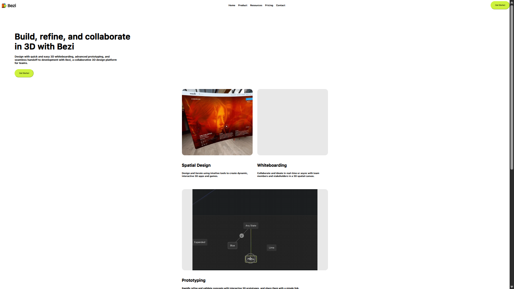
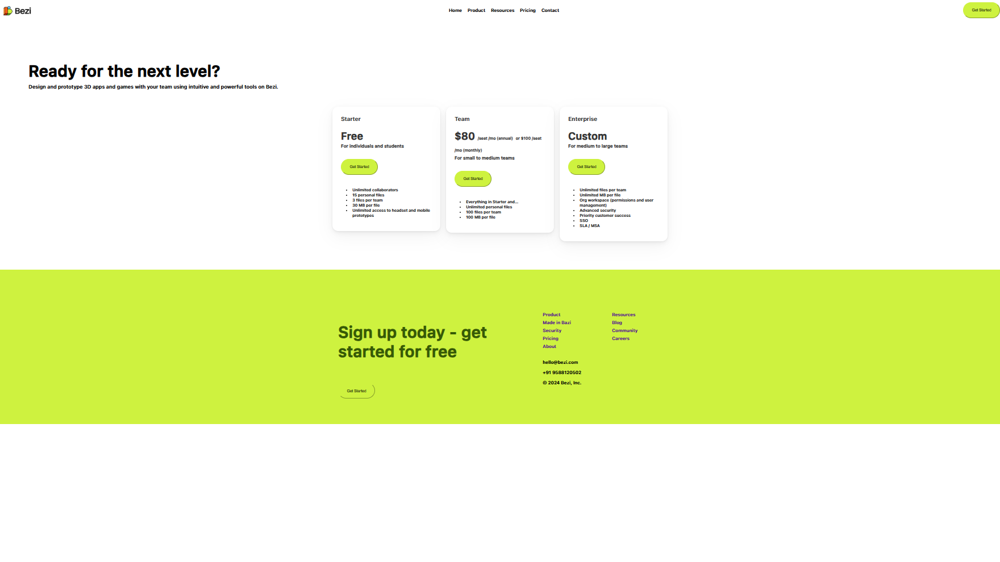

# 🛒 3D Apps & Games E-Commerce Platform (Frontend)

A fully responsive and visually appealing **e-commerce website frontend** for showcasing and selling **3D applications and games**. Built using **HTML**, **CSS**, and **JavaScript**, this project includes key pages such as a homepage, products listing, and a payment page, providing a strong foundation for any e-commerce solution.

---

## 📸 Screenshots

### 🏠 Homepage


### 🎮 Product Page


### 💳 Payment Page


---

## 🧰 Tech Stack

- **HTML5** – Semantic page structure
- **CSS3** – Styling, layout, and responsive design
- **JavaScript (Vanilla)** – Page interactivity and dynamic elements

---

## 🚀 Features

- 🖼️ Beautiful, clean homepage with featured product sections  
- 🎮 Dedicated product page showcasing 3D apps and games  
- 💳 Structured payment page UI for checkout simulation  
- 📱 Fully responsive across devices (mobile, tablet, desktop)  
- 🌈 Modern design principles and user-friendly layout  

---

## 👥 Team Members

| Name         | Role                    | GitHub                                     | Email                                           | LinkedIn                                   |
| ------------ | ----------------------- | ------------------------------------------ | ----------------------------------------------- | ------------------------------------------ |
| Varun Sammal | Frontend Developer      | [GitHub](https://github.com/your-username) | [varun@example.com](mailto:varun@example.com)   | [LinkedIn](https://linkedin.com/in/varun)  |
| Priya Sharma | UI/UX Designer          | [GitHub](https://github.com/priya-uiux)    | [priya@example.com](mailto:priya@example.com)   | [LinkedIn](https://linkedin.com/in/priya)  |
| Rohit Verma  | JavaScript Developer    | [GitHub](https://github.com/rohit-jsdev)   | [rohit@example.com](mailto:rohit@example.com)   | [LinkedIn](https://linkedin.com/in/rohit)  |
| Anjali Mehta | Content & Documentation | [GitHub](https://github.com/anjali-docs)   | [anjali@example.com](mailto:anjali@example.com) | [LinkedIn](https://linkedin.com/in/anjali) |

---

## 🛠️ How to Run Locally

1. **Clone the repository**

```bash
git clone https://github.com/your-username/3d-ecommerce-platform.git
